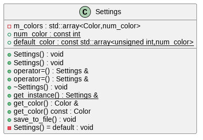

# CS162 (and CS202?) Project: VisuAlgo clone

Author: 22125113 - Nguyen Quang Truong

This is an application that tries to replicate what [VisuAlgo.net](https://visualgo.net)
does, with basic data structures.

Initially, this was a project for the course CS162 - Introduction to Programming
II. However, as I become more ambitious (or even delusional? who cares!), I also
want to pass the lab of CS202 - Programming Systems with this project, despite
it being a future course and not yet available to me - a freshman.

## Features

It currently supports the following data structures:
- Array
- Dynamic Array (similar to `std::vector`)
- Linked List
- Doubly Linked List
- Circular Linked List
- Stack
- Queue

Notable features include:
- Visualization of initialization and CRUD operations of different data structures
- Step-by-step code highlight
- Super customizable color settings (with presets included)
- ... and more to come!

## Demonstration

[Here is the demonstration on YouTube.](https://youtu.be/9E_ZE9IUF1Q)

## Repository
[Here is the repository of the project on GitHub.](https://github.com/jalsol/cs162-visualgo)

## License

This project is licensed under the **GNU GPL v3.0 License**.

## Dependencies

### Application

- C++20 (GNU GCC 11.3.0)
- CMake 3.22 or above
- [Raylib](https://github.com/raysan5/raylib) and [Raygui](https://github.com/raysan5/raygui)
(modified)
- [tiny file dialogs](https://sourceforge.net/projects/tinyfiledialogs/)

### Documentation

- [Doxygen](https://www.doxygen.nl/)
- [PlantUML](https://plantuml.com/)
- [clang-uml](https://github.com/bkryza/clang-uml)

## Building

### Manually

- Clone this repository
- `cmake -S. -Bbuild`
- `make -Cbuild` (or any similar command depending on your build system)
- The executable `visualgo_cpp` in the directory `build/` will appear.

### IDEs with automatic configuration from CMake

These IDEs (e.g. Visual Studio, CLion) can automatically set up the project from the CMake configurations.

Simply open/clone the project from the GitHub repository, configure the project from CMake and build.

### Other IDEs
Please run `cmake -G` to see which are supported by CMake. **The following example will use CodeBlocks on Windows (MinGW). You can replace CodeBlocks with your IDE.**

- Clone this repository
- `cmake -S. -Bbuild -G "CodeBlocks - MinGW Makefiles"`
- The project `visualgo_cpp.cbp` in the directory `build/` will appear
- Launch the project and build inside CodeBlocks.

### WebAssembly and HTML5

- Install Emscripten
- `emcmake cmake -S. -Bbuild -G "Unix Makefiles"`
- `make -Cbuild`
- `emrun build/visualgo_cpp.html` to test run.

### Extra building notes
- If you can’t build the project, please make sure the dependencies are correctly applied;
- If CMake chooses the wrong build system, please run `cmake -G` and read the options;
- You can use the `-j` flag for Make to enable multithreaded compiling (for example, my laptop has 4 cores, so I usually run `make -Cbuild -j4`).

## Project Structure

This project follows [the Pitchfork Layout for modern C++ projects.](https://api.csswg.org/bikeshed/?force=1&url=https://raw.githubusercontent.com/vector-of-bool/pitchfork/develop/data/spec.bs)

- `data/`: Application assets and preset configurations
- `docs/`: Documentation of the project implementation
    - `diagrams/`: PlantUML scripts and generated diagrams
    - `images/`: Images for the user manual
    - `html/`: The deployable HTML version of the documentation
    - `latex/`: The LaTeX version of the documentation
- `examples/`: Examples of the format for file inputs
- `external/`: External dependencies (which are not fetched by CMake)
- `src/`: Source code of the project implementation
    - `component/`: Common modules that are used in different scenes
    - `core/`: **General-purpose** implementations of data structures (can be extended to the GUI version; can replace standard containers in the project itself) and their unit tests
    - `gui/`: GUI versions of the core data structures
    - `scene/`: Scenes to display the GUI data structures, the menu, and the settings

## Documentation

### User manual

Please refer to [`USER_MANUAL.md`](./USER_MANUAL.md).

### Program structure

For the LaTeX version, please refer to [`docs/latex/refman.pdf`](./docs/latex/refman.pdf).

For the HTML version, please see [this webpage](https://jalsol.github.io/cs162-visualgo).

## Modeling structures overview

For a more detailed overview, please refer to the [documentation](#documentation-1).

### Examples of design patterns in this project

- The GUI version of each data structure is designed with the Composite pattern (combining the core version and a GUI base);
- The classes of the `scene` namespace are designed using the Strategy pattern so that the scenes are interchangeable during runtime;
- The rendering and event polling mechanism apply the Chain of Responsibility pattern;
- The `Settings` class is a singleton, as it’s accessible everywhere in the application and there should only exist only one instance of it.

