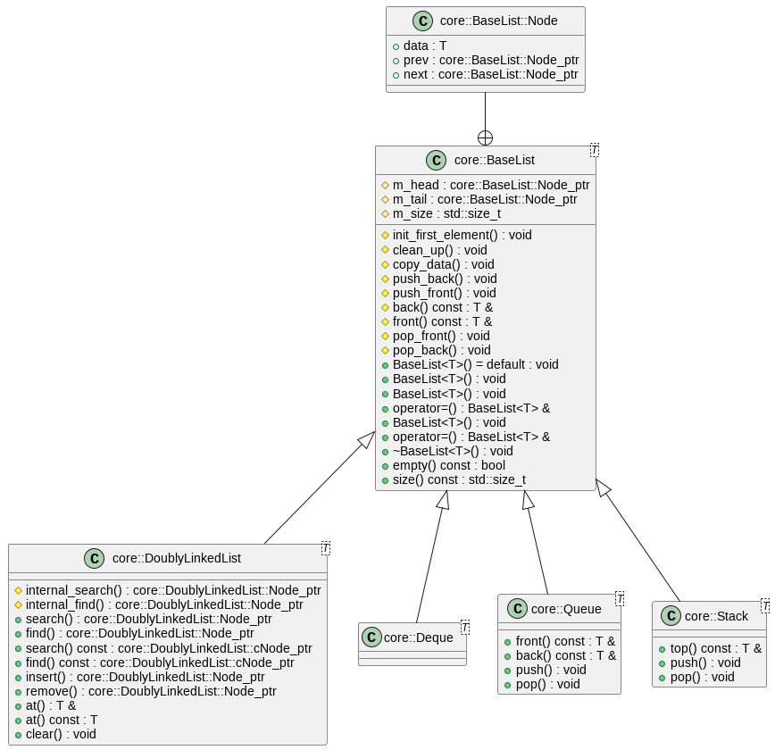
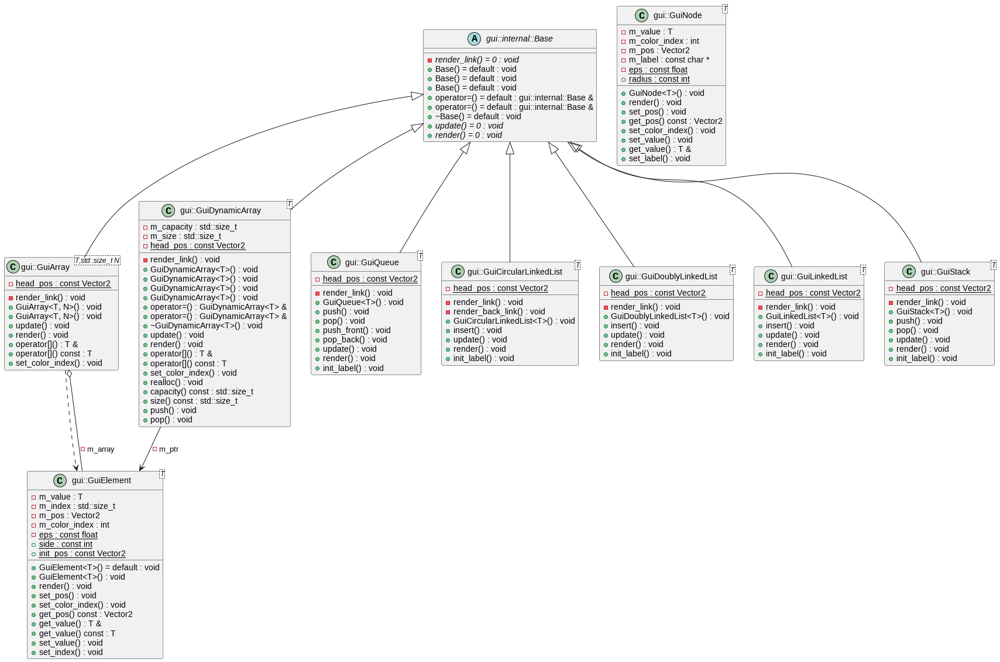
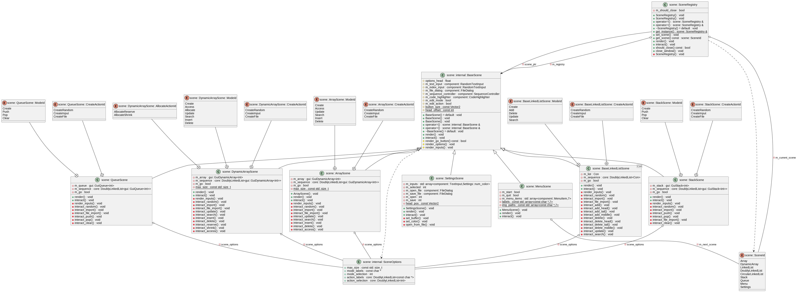
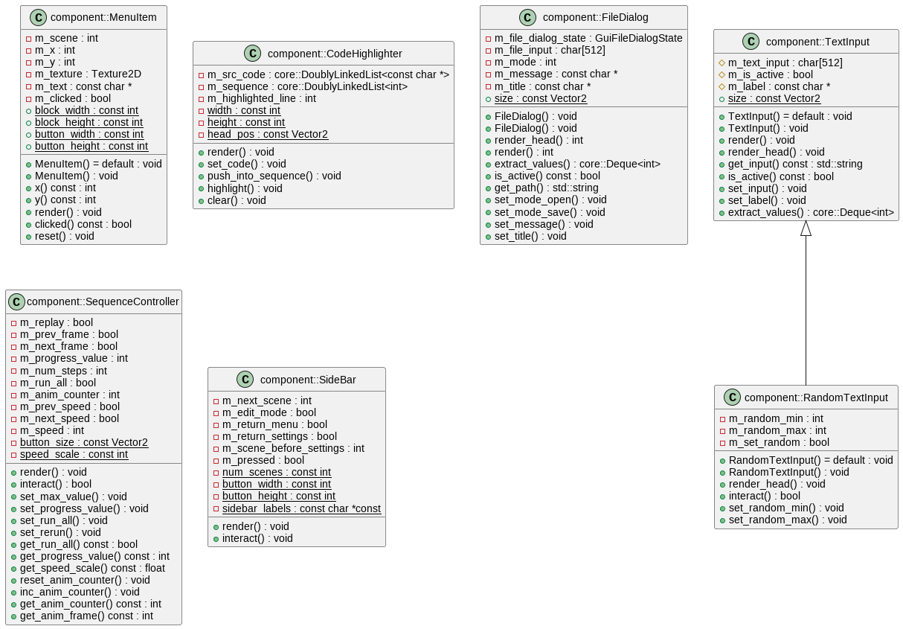

# CS162 Project: VisuAlgo clone

Author: 22125113 - Nguyen Quang Truong

## Demonstration

[To be updated]

## Dependencies

### Application

- C++20 (GNU GCC 11.3.0)
- CMake 3.22 or above
- [Raylib](https://github.com/raysan5/raylib) and [Raygui](https://github.com/raysan5/raygui)
(modified)

### Documentation

- [Doxygen](https://www.doxygen.nl/)
- [PlantUML](https://plantuml.com/)
- [clang-uml](https://github.com/bkryza/clang-uml)

## Building

- Clone this repository
- `cmake -S. -Bbuild`
- `make -Cbuild`
- The executable `visualgo_cpp` will appear.

## Releases

Prebuilt executables should be moved to the root of the repo before running.

## Features

- Visualize different operations of different data structures
(initialization and CRUD operations)
- Highlight lines of codes corresponding to each action
- [WIP] Color and size customization

## License

This project is licensed under the GNU GPL v3.0 License.

## Documentation

### User manual

[To be updated]

### Program structure

For the LaTeX version, please refer to `docs/latex/refman.pdf`.

For the HTML version, please generate with Doxygen using `Doxyfile` as the
configuration. The generated HTML is located at `docs/html/`

## Modeling structures overview

