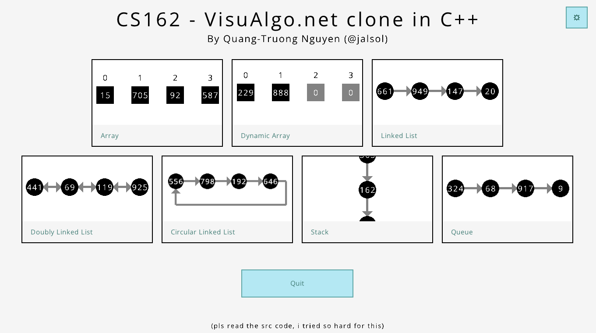
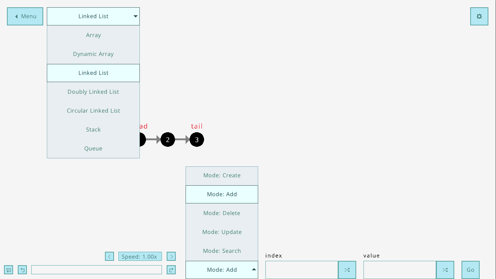
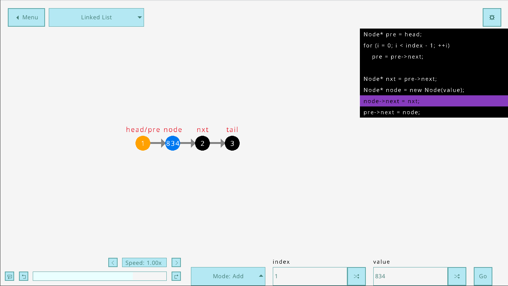
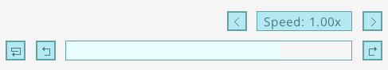
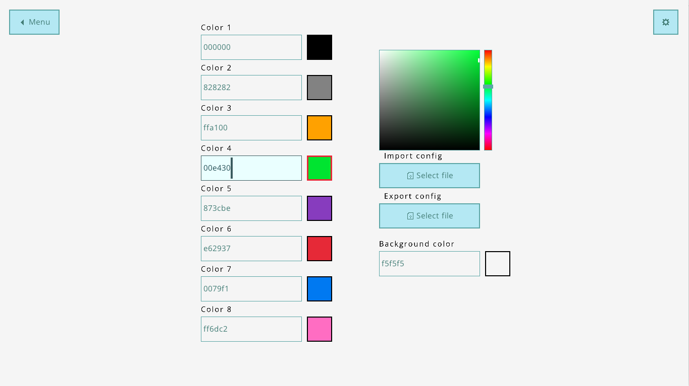

# User Manual

## Menu screen

- Start by clicking on any data structures listed on the menu.
- Enter the settings by clicking on the gear icon button
- Quit the application by clicking on the quit button

## Main view

- Click on the Menu button to return to the menu
- Click on the top dropdown list to change to another data structure
- Click on the bottom dropdown list to change the operation to demonstrate
- Each input has a button to generate a random value
- Click on the Go button to start the operation

This is what the screen looks like when an operation is running. A code highlighter also appears.

## Sequence controller

This is the animation sequence controller, found in the bottom-left corner.
- Adjust the speed by clicking on the two arrow buttons in the first row
- In the second row, the leftmost button is for replaying the animation; the other buttons are to move to the previous/next step of the animation

## Settings

- Click on each color to edit it, either by typing the hex code or using the color picker
- Each color is adjustable to allow freedom (as in the "free" of free-and-open-source software)
- Color palettes can be imported and exported
- The application also comes with a dark theme, located at `data/themes/tokyonight.bin`
- Application texts are adaptive to the background color (i.e. if the background color is dark, the texts are white and vice versa)

